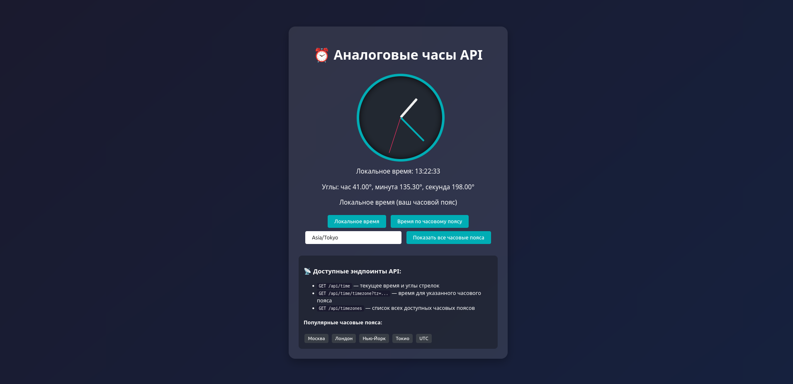
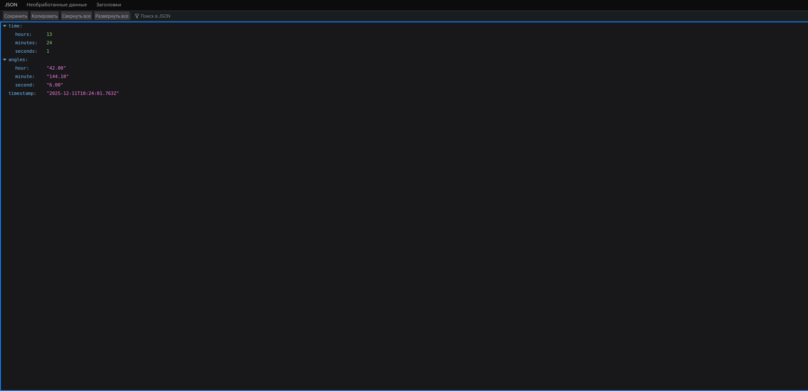
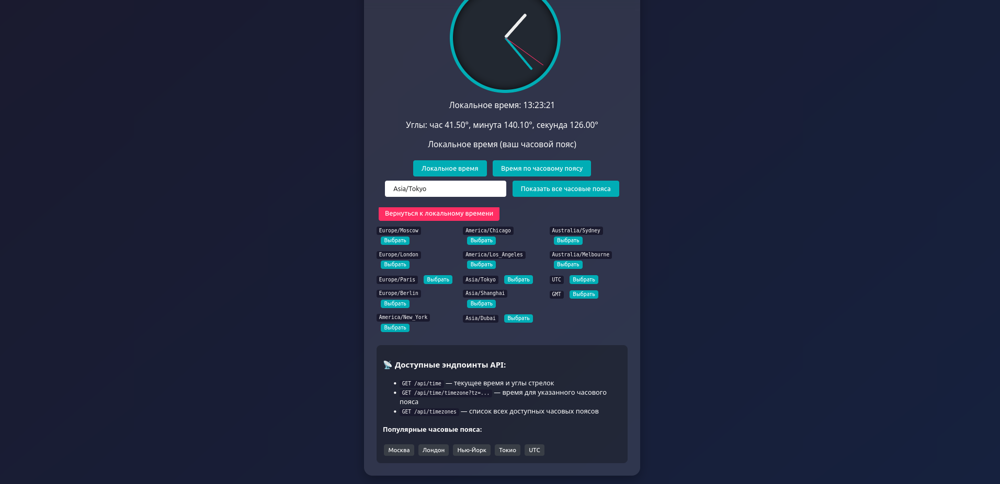

# ⏰ Analog Clock API

Express.js приложение для отображения аналоговых часов через API.

## 📸 Скриншоты

### Главная страница с аналоговыми часами


### Ответ API в формате JSON


### Пример работы с часовыми поясами


## 📋 Требования

- Node.js 14+
- npm или yarn

## 🚀 Установка и запуск

```bash
# Клонирование репозитория
git clone <ваш-репозиторий>
cd analog-clock-api

# Установка зависимостей
npm install

# Запуск в режиме разработки
npm run dev

# Или запуск в продакшн режиме
npm start